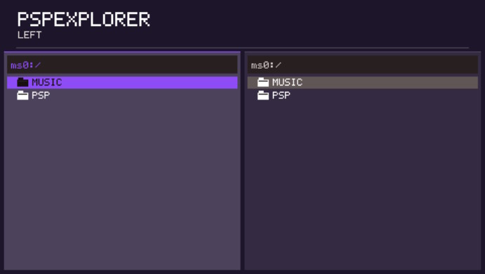

# PSPExplorer

File Explorer for PlayStation Portable, written in C

[](https://github.com/violinmelody/PSPExplorer/actions/workflows/build.yml) [](https://github.com/violinmelody/PSPExplorer/actions/workflows/smoketest.yml)


**Version:** 1.0.0  
**Author:** Miss Violin Melody  
**Website:** https://violinmelody.net



This project is not affiliated with or endorsed by Sony. [PSPDEV/PSPSDK](https://github.com/pspdev/pspsdk) is the open-source SDK/toolchain used to build this program.

## Features

- Dual folder switchable view
- Copy, move, paste, rename, select, delete, new file/folder operations
- Theme with selectable accent color
- Built in text editor, image viewer (PNG, JPG & 24/32-bit BMP) and audio player (WAV, MP3 & PCM)

## Controls

```
D-pad	-	select entries
	❌	-	open
	⭕	-	back
	🔺	-	menu
	L/R -	switch active view
```

## Requirements

Install [PSPDEV/PSPSDK](https://github.com/pspdev/pspsdk). The official Docker image is also supported: https://pspdev.github.io/installation/docker.html

For a local installation, `PSPDEV` and `PSPSDK` must be exported and the PSP toolchain must be on `PATH`, e.g.:

```sh
export PSPDEV=/opt/pspdev
export PSPSDK="$PSPDEV/psp/sdk"
export PATH="$PATH:$PSPDEV/bin:$PSPDEV/psp/bin"
```

The toolchain needs libpng, libjpeg and zlib from the PSPDEV package set

## Clone the repository

Install Git then clone the repository and enter its directory:

```sh
git clone https://github.com/violinmelody/PSPExplorer
cd PSPExplorer
```

## Build

From the repository root:

```sh
make clean
make -j$(nproc)
```

The build creates `EBOOT.PBP` in the repository root.

To rebuild after editing source files, normally only this is needed:

```sh
make -j$(nproc)
```

To force a completely clean build:

```sh
make clean
make -j$(nproc)
```

### Build with the official PSPDEV Docker image

```sh
docker pull pspdev/pspdev:latest
docker run --rm -v "$PWD:/source" -w /source pspdev/pspdev:latest sh -lc 'make clean && make -j$(nproc)'
```

## Install on a PSP

Create:

```text
ms0:/PSP/GAME/PSPExplorer/
```

Copy the compiled file to:

```text
ms0:/PSP/GAME/PSPExplorer/EBOOT.PBP
```

The PSP must be configured to run homebrew software.

## License

THE SOFTWARE IS PROVIDED “AS IS” AND THE AUTHOR DISCLAIMS ALL WARRANTIES WITH REGARD TO THIS SOFTWARE INCLUDING ALL IMPLIED WARRANTIES OF MERCHANTABILITY AND FITNESS. IN NO EVENT SHALL THE AUTHOR BE LIABLE FOR ANY SPECIAL, DIRECT, INDIRECT, OR CONSEQUENTIAL DAMAGES OR ANY DAMAGES WHATSOEVER RESULTING FROM LOSS OF USE, DATA OR PROFITS, WHETHER IN AN ACTION OF CONTRACT, NEGLIGENCE OR OTHER TORTIOUS ACTION, ARISING OUT OF OR IN CONNECTION WITH THE USE OR PERFORMANCE OF THIS SOFTWARE.

The source code is shared under the MIT license - see [LICENSE](./LICENSE).